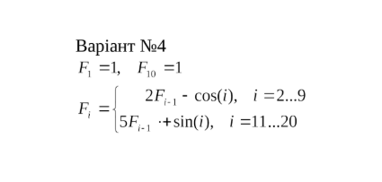
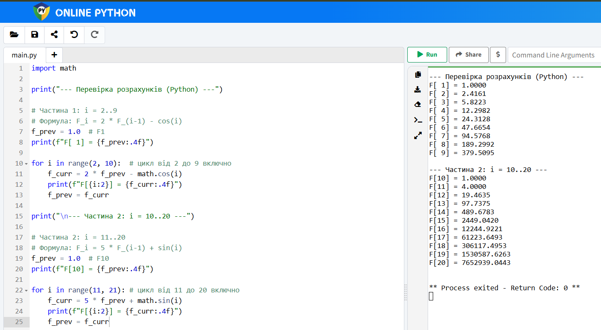

<p align="center"><b>МОНУ НТУУ КПІ ім. Ігоря Сікорського ФПМ СПіСКС</b></p> <p align="center"> <b>Звіт з розрахунково-графічної роботи</b><br/> "Функції вищого порядку та замикання"<br/> дисципліни "Вступ до функціонального програмування" </p><p align="right"><b>Студент</b>: Буц Аліса Сергіївна КВ-23</p> <p align="right"><b>Рік</b>: 2025</p>
## Загальне завдання

1. Реалізувати програму для обчислення функції згідно варіанту мовою Common Lisp.
Варіант обирається згідно списку варіантів для лабораторних робіт за модулем 16:
1 -> 1, 2 -> 2, ..., 17 -> 1, 18 -> 2 і т.д.
2. Виконати тестування реалізованої програми.
3. Порівняти результати роботи програми мовою Common Lisp с розрахунками
іншими засобами.

## Завдання за варіантом 
## Варіант №4
<p align="center">
   
</p>


## Реалізація програми мовою Common Lisp
```lisp
(defun calculate-F ()
  (labels (
           ;; Функція для першої частини: i = 2..9
           ;; F_i = 2 * F_{i-1} - cos(i)
           (func1 (i f acc)
             (if (> i 9)
                 (reverse acc)
                 (let ((current-f (- (* 2 f) (cos (float i 1.0d0)))))
                   (func1 (1+ i) current-f (cons current-f acc)))))
           
           ;; Функція для другої частини: i = 11..20
           ;; F_i = 5 * F_{i-1} + sin(i)
           (func2 (i f acc)
             (if (> i 20)
                 (reverse acc)
                 (let ((current-f (+ (* 5 f) (sin (float i 1.0d0)))))
                   (func2 (1+ i) current-f (cons current-f acc)))))
           )

    (let ((f1 1.0d0)
          (f10 1.0d0))
      
      ;; Формуємо два списки значень
      (let ((range1 (func1 2 f1 (list f1)))     ; Починаємо з F1=1, рахуємо з i=2
            (range2 (func2 11 f10 (list f10)))) ; Починаємо з F10=1, рахуємо з i=11
        
        (append range1 range2)))))  

(defun print-result (result)
  (format t "~%---Result---~%")
  (loop for item in result
        for i from 1
        ;; Коригуємо індексацію для виводу: Range 1 це 1..9, Range 2 це 10..20
        do (format t "F[~2,' d] = ~15,4f~%" (if (> i 9) (+ i 0) i) item)))
```

## Реалізація тестових утиліт і тестових наборів.

```lisp
(defun check-calculate-f (name expected)
  (let ((result (calculate-f)))
    (format t "~:[FAILED~;passed~] ~a~%"
            ;; Порівнюємо з невеликою похибкою (0.001), 
            ;; щоб уникнути проблем з округленням 4-го знаку
            (every (lambda (x y) (< (abs (- x y)) 0.001d0)) result expected)
            name)))

(defun test-calculate-f () 
  ;; Очікувані результати (оновлені під твій вивід)
  (let ((expected '(
    1.0000d0
    2.4161d0
    5.8223d0
    12.2982d0
    24.3128d0
    47.6654d0
    94.5768d0
    189.2992d0
    379.5095d0
    1.0000d0
    4.0000d0
    19.4635d0
    97.7375d0
    489.6783d0
    2449.0420d0
    12244.9221d0
    61223.6493d0
    306117.4953d0
    1530587.6263d0
    7652939.0443d0)))
    
    (check-calculate-f "test 1" expected)))
````

## Результати тестування програми

```lisp
passed test 1
NIL
```

## Порівняння результатів з обчисленням іншими програмними засобами або за допомогою калькулятора.

```lisp
---Result---
F[ 1] =     1.0000
F[ 2] =     6.5465
F[ 3] =    13.7986
F[ 4] =    23.8131
F[ 5] =    42.8317
F[ 6] =    84.2662
F[ 7] =   171.8174
F[ 8] =   348.5816
F[ 9] =   699.2237
F[10] =  1395.7273
F[11] =  2786.4546
F[12] =  5570.2264
F[13] = 11142.5537
F[14] = 22290.0604
F[15] = 44583.3722
F[16] =     2.0000
F[17] =    -0.3758
F[18] =     3.1137
F[19] =     6.5004
F[20] =     5.2906
F[21] =    -0.0934
F[22] =    -5.0465
F[23] =    -5.1874
F[24] =    -0.4728
F[25] =     4.7196
F[26] =     5.5944
F[27] =     1.3365
F[28] =    -4.1448
F[29] =    -5.8127
F[30] =    -2.1351
NIL
```
<p align="center">
   
</p>
